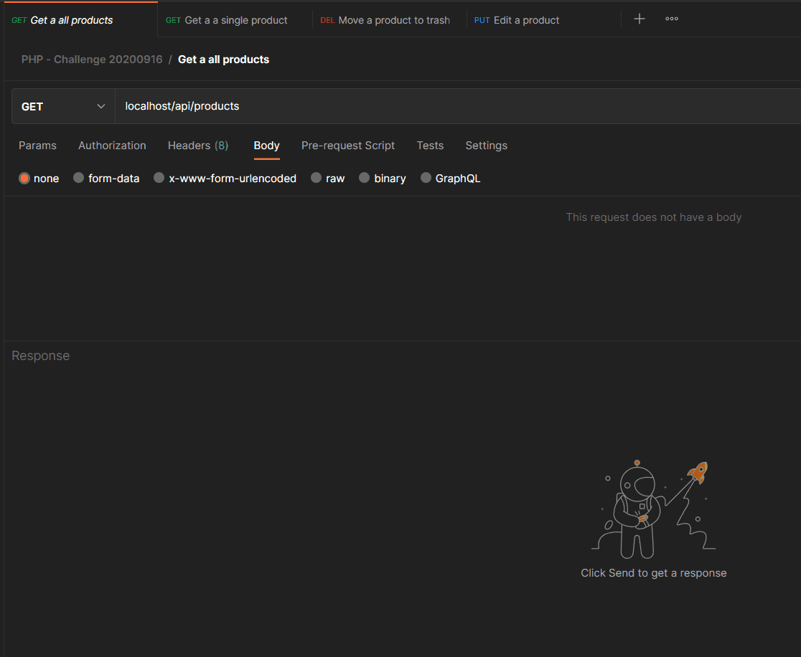

# PHP Challenge 20200916

### Esta aplicação é uma API REST que utiliza dados do projeto Open Food Facts para popular sua base de dados

[disponível aqui](https://challenge-php.herokuapp.com/api/products)




## Instalação e configuração da API

Faça o clone do respositório
```bash
git clone https://github.com/Ronildo-Sousa/php-challenge.git
```

Na pasta do projeto instale as dependências
```docker
docker run --rm \
        -u "$(id -u):$(id -g)" \
        -v $(pwd):/var/www/html \
        -w /var/www/html \
        laravelsail/php81-composer:latest \
        composer install --ignore-platform-reqs
```

Crie o arquivo .env
```bash
cp .env.example .env
```

Inicialize o container do Laravel Sail
```bash
./vendor/bin/sail up -d
```

Crie a chave da aplicação
```bash
./vendor/bin/sail artisan key:generate
```

Execute as migrations e seeders
```bash
./vendor/bin/sail artisan migrate --seed
```

## Endpoints

Acesse a [documentação](https://documenter.getpostman.com/view/15881488/2s8ZDYX1ok) para mais detalhes.

Método   | URI
--------- | ------
GET | /api/products
GET | /api/products/{code}
PUT | /api/products/{code}
DELETE | /api/products/{code}
